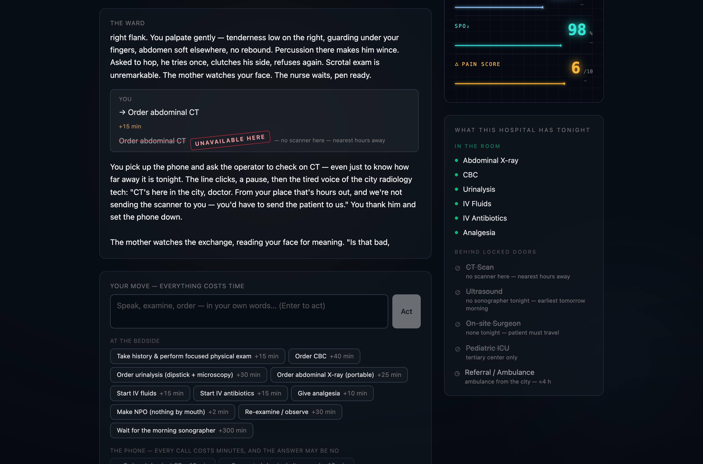

# SALUS Zero

[](https://github.com/sahinparlak/salus-zero/actions/workflows/ci.yml)

**A clinical training simulator for medicine where nothing is available.**

**Live demo:** https://salus-zero.pages.dev

Most medical training assumes a hospital that has everything. But most of the
world's children are treated where there is no CT, no ultrasound, no surgeon in
the building — only a clock and a single doctor. SALUS Zero trains
decision-making for *that* world. Its signature constraint: **you cannot order a
CT** — you decide with what the clinic actually has.

> **A new, from-scratch simulation engine built during the *Built with Claude:
> Life Sciences* hackathon — part of the broader SALUS Zero vision.**

Built solo with Claude Code by a practicing pediatric surgery resident.



---

## Status — two products, one thesis

The engine is live and plays end to end. Two doors share it:

- **The scored night (training simulator).** A deterministic case engine — the
  clock, the stage physiology, the vitals and every lab value are computed in
  code; the model only narrates the world. When the night is decided, a debrief
  scores it 0–100 with arithmetic you can read line by line: referral timing,
  resource discipline, differential workup. The score comes from
  [`functions/lib/score.ts`](functions/lib/score.ts), never from the model.
- **The consult companion (real-patient decision support).** A grounded,
  deliberately narrow appendicitis companion for the clinician with a real
  child in front of them: reference-anchored, mimic-forcing, dose-refusing,
  PHI-ephemeral. Its PAS/Alvarado numbers are code-computed
  ([`functions/lib/consultScore.ts`](functions/lib/consultScore.ts)) and handed
  to the model as data.

**Architecture, in five lines.** The browser talks only to Cloudflare Pages
Functions (`/api/*`); each function builds the prompt, calls Anthropic, and
relays the SSE stream back as plain text. Everything secret — the hidden
diagnosis, future stages, ground truth, scoring — lives worker-side under
[`functions/`](functions/) and never reaches the client bundle: the browser
gets a public projection of the case and a state header per turn, nothing more.
The model narrates and teaches; the code owns the clock, the physiology and
the number.

## Run locally

```bash
pnpm install
cp .dev.vars.example .dev.vars      # then paste your Anthropic API key
pnpm build                          # build the frontend into dist/
pnpm preview                        # serves dist/ + functions with your key
```

Open the printed URL and pick a door — **Bring the patient in front of you**
(the consult companion) or **train for that night** (the scored simulator).
Without a key the endpoints stream a local mock, so you can verify the
transport before wiring the real call.

## Deploy (Cloudflare Pages)

```bash
pnpm build
pnpm exec wrangler login                              # one-time browser auth
pnpm exec wrangler pages secret put ANTHROPIC_API_KEY # paste key when prompted
pnpm deploy
```

## Clinical safety

**This is a training simulation, not medical advice.** All doses and thresholds
shown are illustrative. Clinically reviewed by Şahin Parlak, MD (Pediatric
Surgery).

## License

[AGPL-3.0-or-later](LICENSE).
